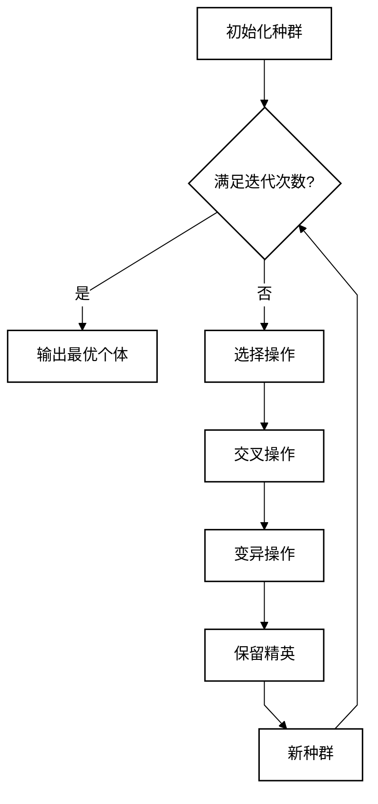
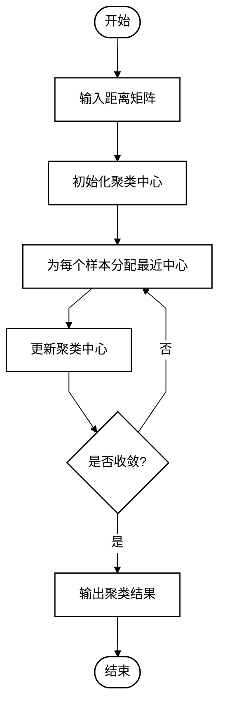

# 国赛理论部分图表绘制参考

理论部分图表用于呈现建模思路、求解流程、算法流程和算法伪代码。国赛理论图表的核心原则是：**简洁、简约、黑白线条**。

## 1. 可用图表类型

理论部分鼓励使用以下图表：

- **流程图**：展示建模或求解的整体流程。
- **算法流程图**：用流程图展示算法的输入、迭代、判断和输出。
- **算法文字图**：用三线表形式描述算法伪代码或算法步骤，这是论文中常见的“算法图”。
- **结构图**：展示模型架构或模块关系。
- **示意图**：解释题目中涉及的关键概念或过程。

## 2. 绘制工具

- 流程图、算法流程图、结构图、示意图推荐使用 Mermaid 源文件生成 PNG。
- 算法文字图优先使用 markdown 表格，由 docx 转换脚本生成三线表；不要把算法文字图写成普通代码块。
- `convert_md_to_docx.js` 不直接渲染 Mermaid 代码块，必须先用 `scripts/render_mermaid.js` 生成图片，再在 markdown 中引用图片。
- 同一张图只能维护一份 Mermaid 源。若文档中展示 Mermaid 示例，应把同一段代码保存为 `.mmd` 后渲染；不要在 markdown 示例和 `.mmd` 文件中分别写两套结构。

## 3. 国赛风格配置

国赛流程图采用黑白配色，Mermaid 初始化配置如下：

```mermaid
%%{init: {'theme': 'base', 'themeVariables': {'primaryColor': '#ffffff', 'primaryTextColor': '#000000', 'primaryBorderColor': '#000000', 'lineColor': '#000000', 'secondaryColor': '#ffffff', 'tertiaryColor': '#ffffff'}, 'flowchart': {'curve': 'linear'}}}%%
flowchart TD
    classDef bw fill:#ffffff,stroke:#000000,stroke-width:1.5px,color:#000000
```

- 节点填充色：白色 `#ffffff`
- 节点边框色：黑色 `#000000`
- 文字颜色：黑色 `#000000`
- 连线颜色：黑色 `#000000`
- 不使用阴影、渐变、圆角过大等装饰。
- 线型使用直线（`curve: linear`），减少曲线带来的视觉复杂感。

## 4. 示例：遗传算法流程图



## 5. 算法流程图示例

算法流程图用于可视化算法运行路径，重点展示输入、迭代、判断和输出。它属于流程图，不等同于算法文字图。



## 6. 算法文字图模板

算法文字图用三线表描述算法步骤，适合放在模型建立或求解方法介绍中。

```markdown
表 2-1  遗传算法求解步骤

| 步骤 | 操作 |
|------|------|
| 1 | 初始化种群规模、交叉概率、变异概率和最大迭代次数 |
| 2 | 根据目标函数计算每个个体的适应度 |
| 3 | 执行选择、交叉和变异操作，生成新种群 |
| 4 | 保留当前最优个体并更新种群 |
| 5 | 若达到终止条件，则输出最优方案；否则返回步骤 2 |
```

写作要求：

- 标题使用「表 章-序号  算法名称或算法步骤」。
- 表格只保留“步骤/操作”两列，必要时可增加“输入/输出”，但不要超过 3 列。
- 每步用短句描述，不写大段代码。
- 若算法较长，只保留主流程，细节放入附录代码。

## 7. 绘制规范

- 每个流程图必须有明确的开始和结束节点。
- 判断节点使用菱形，处理节点使用矩形，开始/结束节点使用圆角矩形或椭圆形。
- 箭头方向统一，避免交叉过多。
- 文字简洁，节点内不超过一行或两行。
- 生成图片后保存为 PNG，分辨率不低于 150 dpi。

## 8. 输出方式

1. 将最终 Mermaid 源码保存为 `.mmd` 文件。
2. 若需要在写作说明中展示 Mermaid 代码，直接复用 `.mmd` 文件内容。
3. 使用 `node scripts/render_mermaid.js diagrams/problem1_flow.mmd --output images/problem1_flow.png` 生成 PNG。
4. 将图片放入 `images/` 目录。
5. 在 md 中引用：
   ```markdown
   
   ```
6. 转换前运行 `node scripts/preflight_md.js paper.md`，确认图片存在且 markdown 中没有未渲染的 Mermaid 代码块。

## 9. 禁止事项

- 禁止使用彩色渐变、阴影、3D 效果。
- 禁止一个图中包含过多分支，导致阅读困难。
- 禁止流程图与结果可视化混用（结果部分见 `cn_result_chart_guide.md`）。
- 禁止用占位图代替 Mermaid 渲染结果。
- 禁止把算法文字图误写成 Mermaid 流程图；若需要伪代码表达，应使用三线表算法文字图。
- 禁止同一张图在 markdown 和 `.mmd` 中使用不同结构，导致预览图与最终渲染图不一致。
