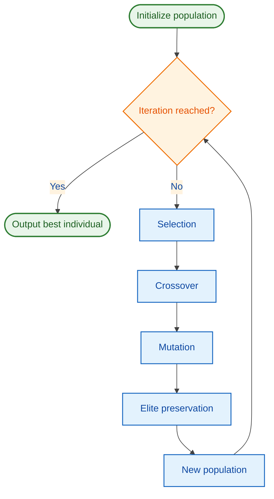
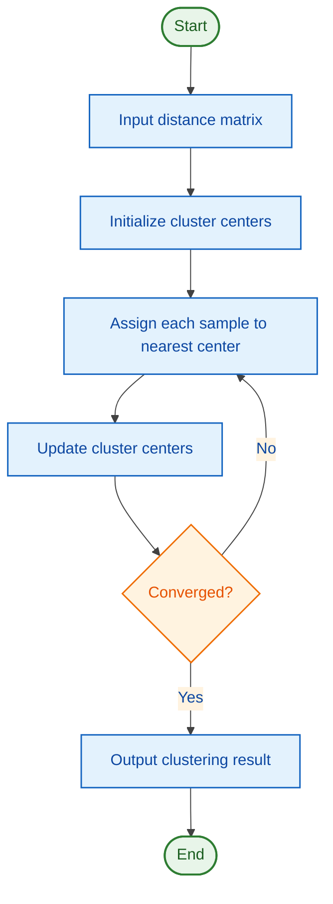

# MCM/ICM Theoretical Chart Reference

Charts in the theoretical section present modeling ideas, solution workflows, algorithm workflows, and algorithm pseudocode. The core principle for MCM/ICM theoretical charts is: **aesthetic, visually clear, and color-friendly**.

## 1. Allowed Chart Types

The theoretical section encourages the following chart types:

- **Flowcharts**: show the overall modeling or solution workflow.
- **Algorithm flowcharts**: visualize algorithm inputs, iterations, decisions, and outputs.
- **Algorithm text diagrams**: present pseudocode or algorithm steps as a three-line table. This is the preferred "algorithm diagram" form in the paper body.
- **Architecture diagrams**: show model structure or module relationships.
- **Conceptual diagrams**: explain key concepts or processes involved in the problem.

## 2. Drawing Tools

- Use Mermaid source files to generate PNG images for flowcharts, algorithm flowcharts, architecture diagrams, and conceptual diagrams.
- Use markdown tables for algorithm text diagrams; the converter will turn them into three-line tables.
- `convert_md_to_docx.js` does not render Mermaid code blocks directly. Render Mermaid first with `scripts/render_mermaid.js`, then reference the generated image in markdown.
- Maintain only one Mermaid source for each diagram. If a Mermaid example is shown in markdown, save that exact same source as the `.mmd` file and render it; do not write a different structure in the `.mmd` file.

## 3. MCM/ICM Style Configuration

MCM/ICM flowcharts may use clean, modern color schemes. A recommended configuration uses distinct but harmonious colors for different node types:

```mermaid
%%{init: {'theme': 'base', 'themeVariables': {'primaryColor': '#E3F2FD', 'primaryTextColor': '#0D47A1', 'primaryBorderColor': '#1565C0', 'lineColor': '#424242', 'secondaryColor': '#FFF3E0', 'tertiaryColor': '#E8F5E9'}, 'flowchart': {'curve': 'basis'}}}%%
flowchart TD
    classDef startEnd fill:#E8F5E9,stroke:#2E7D32,stroke-width:2px,color:#1B5E20
    classDef process fill:#E3F2FD,stroke:#1565C0,stroke-width:1.5px,color:#0D47A1
    classDef decision fill:#FFF3E0,stroke:#EF6C00,stroke-width:1.5px,color:#E65100
```

- Start/end nodes: soft green
- Process nodes: soft blue
- Decision nodes: soft orange
- Text colors: dark, readable
- Lines: dark gray
- Use smooth curves (`curve: basis`) for a polished look.

## 4. Example: Genetic Algorithm Flowchart



## 5. Algorithm Flowchart Example

An algorithm flowchart visualizes the execution path of an algorithm. It focuses on inputs, iterations, decisions, and outputs. It is still a flowchart and is not the same as an algorithm text diagram.



## 6. Algorithm Text Diagram Template

An algorithm text diagram should be written as a three-line table. Use it when the paper needs to describe the algorithm procedure compactly.

```markdown
Table 2-1  Genetic algorithm procedure

| Step | Operation |
|------|-----------|
| 1 | Initialize population size, crossover probability, mutation probability, and maximum iterations |
| 2 | Evaluate the fitness value of each individual according to the objective function |
| 3 | Perform selection, crossover, and mutation to generate a new population |
| 4 | Preserve the current best individual and update the population |
| 5 | If the stopping criterion is met, output the best solution; otherwise return to Step 2 |
```

Writing requirements:

- Use the caption format "Table X-Y  Algorithm name or procedure".
- Prefer two columns: "Step" and "Operation". Add "Input/Output" only when necessary, and keep the table within three columns.
- Use short operational sentences rather than long code-like paragraphs.
- If the algorithm is long, keep the main procedure here and move implementation details to the appendix.

## 7. Drawing Standards

- Every flowchart must have clear start and end nodes.
- Decision nodes use diamonds; process nodes use rectangles; start/end nodes use rounded rectangles or stadium shapes.
- Arrow directions should be consistent; minimize excessive crossings.
- Keep text concise; no more than one or two lines per node.
- Save generated images as PNG at 150 dpi or higher.

## 8. Output Workflow

1. Save the final Mermaid source as a `.mmd` file.
2. If the paper notes show Mermaid code, reuse the exact `.mmd` content.
3. Run `node scripts/render_mermaid.js diagrams/problem1_flow.mmd --output images/problem1_flow.png`.
4. Place the image in the `images/` directory.
5. Reference it in the markdown:
   ```markdown
   
   ```
6. Before conversion, run `node scripts/preflight_md.js paper.md` to confirm that images exist and no unrendered Mermaid code block remains.

## 9. Prohibited Practices

- Avoid cluttered diagrams with too many branches.
- Avoid using the same chart style for result visualization (result charts are covered in `en_result_chart_guide.md`).
- Ensure colors remain distinguishable in grayscale, since some judges may print papers in black and white.
- Do not use placeholder images instead of rendered Mermaid output.
- Do not treat algorithm text diagrams as Mermaid flowcharts. Use three-line tables for pseudocode-style algorithm descriptions.
- Do not let the markdown Mermaid preview and the rendered `.mmd` output describe different diagram structures.
